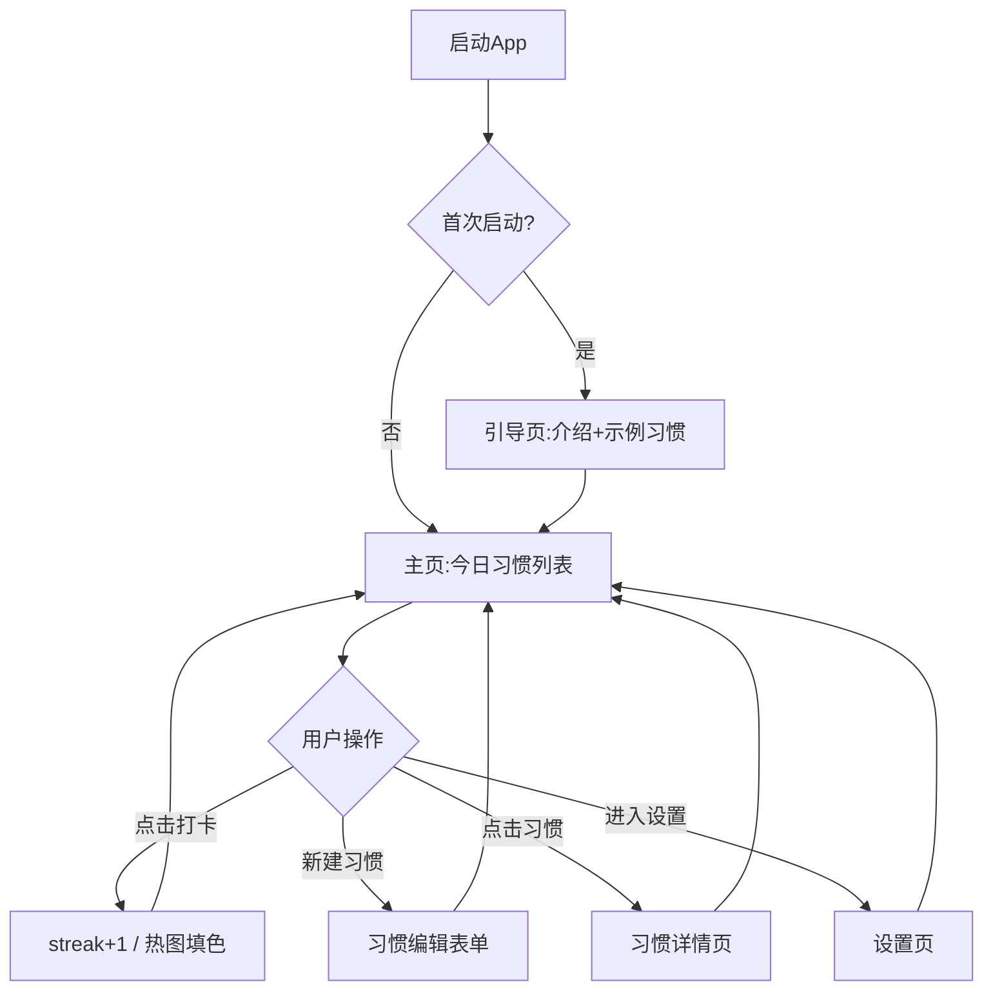

# PRD · habit_zh 中文习惯追踪

> 移动App工厂 · 项目2 产品规划 · 输出
> 骨架对应：2.1 PRD撰写 / 2.2 架构设计 / 2.3 任务拆解

## 0. 元信息

| 项 | 值 |
|---|---|
| App 名 | `habit_zh` |
| 中文名 | 「习惯记」中文习惯追踪 |
| 版本 | 0.1.0 (MVP) |
| 平台 | Android only（API 24+） |
| 技术栈 | Python 3.10+ / Flet 0.86+ / pydantic 2 / uv |
| 仓库路径 | `apps/habit_zh/` |
| 立项决策 | 方案A 优化型（详见 `记忆/决策.md`） |
| 关键路径 | 本地存储、零账号、零广告、零 paywall、中文优先 |

## 1. MVP 功能清单（5 项）

| # | 功能 | 描述 | 优先级 |
|---|---|---|---|
| F1 | 习惯管理 | 增/删/改习惯（名称/图标/颜色/频率） | P0 |
| F2 | 每日打卡 | 一次点击完成当日；可补打前 N 天 | P0 |
| F3 | Streak + 日历热图 | 连续天数计数 + GitHub 风格月历热图 | P0 |
| F4 | 灵活提醒 | 按「每周哪几天/时间」触发通知 | P0 |
| F5 | 本地备份/导出 | JSON 备份 + CSV 导出 | P0 |

后续版本规划（不在 MVP 内）：拖动排序（P1）、习惯分组/标签（P1）、统计数据图（P1）、深色模式（P1）、跨日宽限期配置（P1）、多语言英文（P2）。

## 2. 用户流程图（Mermaid）



## 3. 数据模型（pydantic v2）

```python
# models/habit.py
from datetime import date, time
from enum import Enum
from pydantic import BaseModel, Field

class HabitFrequency(str, Enum):
    DAILY = "daily"               # 每天
    WEEKLY = "weekly"             # 指定星期几
    INTERVAL = "interval"        # 每 N 天

class Habit(BaseModel):
    id: str                       # uuid4 hex
    name: str                     # 习惯名 ≤20 字
    icon: str = "check_circle"    # Material icon name
    color: str = "#2196F3"        # hex
    frequency: HabitFrequency = HabitFrequency.DAILY
    target_days: list[int] = Field(default_factory=list)  # 0-6 (Mon-Sun), weekly 时用
    interval_days: int = 1        # interval 时用
    remind_time: time | None = None
    created_at: date              # 创建日期
    archived: bool = False
    sort_index: int = 0

# models/check_in.py
class CheckIn(BaseModel):
    id: str
    habit_id: str
    date: date                    # 打卡归属日（非打卡时刻）
    created_at: datetime          # 实际打卡时刻
    note: str = ""                # 备注（P1）

# models/streak.py
class Streak(BaseModel):
    habit_id: str
    current: int                  # 当前连续天数
    longest: int                  # 最长连续
    last_check_in: date | None    # 上次打卡日
```

## 4. UI 草图（文字+布局）

### 4.1 主页 `/home`
```
┌────────────────────────────┐
│ AppBar: 习惯记  ⚙️ 设置     │
├────────────────────────────┤
│ 2026-07-20 周一  今日 3/5   │  ← 日期 + 完成率
├────────────────────────────┤
│ ☑ 早睡 23:00  streak 12 🔥  │  ← 已打卡（绿色）
│ ☑ 喝水 8杯    streak 30 🔥  │
│ ☐ 冥想 10分   streak 5  🔥  │  ← 未打卡
│ ☐ 读书 30分   streak 0     │
│ ☐ 八段锦       streak 0    │
├────────────────────────────┤
│        ＋ 新建习惯          │  ← FAB
└────────────────────────────┘
```

### 4.2 习惯详情 `/habit/{id}`
```
┌────────────────────────────┐
│ ← 早睡         ✏️ 🗑️       │
├────────────────────────────┤
│ 当前 streak: 12 天 🔥       │
│ 最长 streak: 21 天          │
│ 本月完成率: 80%             │
├────────────────────────────┤
│ [GitHub 风格热图 12 周]     │
│ ▢▢▢▢▢▢▢                    │
│ ▢▣▢▣▣▢▢                    │
│ ▣▣▣▣▣▣▣                    │
├────────────────────────────┤
│ 频率: 每天 23:00 提醒       │
│ 创建于: 2026-07-01          │
└────────────────────────────┘
```

### 4.3 习惯编辑 `/habit/{id}/edit` & `/habit/new`
```
┌────────────────────────────┐
│ ← 新建习惯          保存    │
├────────────────────────────┤
│ 名称: [____________]        │
│ 图标: [选择 Material icon]  │
│ 颜色: [色板]                │
│ 频率: ( )每天 (•)每周 ( )间隔│
│ 每周哪几天: 一三五六        │
│ 间隔天数: [___] (灰显)      │
│ 提醒时间: [23:00]           │
└────────────────────────────┘
```

### 4.4 设置 `/settings`
```
┌────────────────────────────┐
│ ← 设置                     │
├────────────────────────────┤
│ 数据                       │
│  ▸ 导出 JSON 备份           │
│  ▸ 导出 CSV                 │
│  ▸ 导入备份                 │
│ 主题                       │
│  ( )跟随系统 (•)亮 ( )暗    │
│ 关于                       │
│  版本 0.1.0                │
│  作者 宙斯                  │
└────────────────────────────┘
```

## 5. 非功能需求

| 维度 | 指标 |
|---|---|
| 启动时间 | <3s（冷启动） |
| 包体积 | <50MB |
| 内存 | <150MB 常驻 |
| 数据安全 | 仅本地，零上报 |
| 兼容性 | Android 7.0+（API 24+） |
| 无障碍 | 触控区域 ≥48dp，文字可放大 |
| i18n | 中文优先；英文预留 |

## 6. 验收标准

- [ ] 可创建/编辑/删除/归档习惯
- [ ] 每日点击完成打卡
- [ ] streak 正确计算（含跨日宽限到次日 04:00）
- [ ] 月历热图正确渲染 12 周
- [ ] 提醒通知按指定星期几/时间触发
- [ ] JSON 备份与 CSV 导出文件正确
- [ ] 数据完全本地存储，无网络请求
- [ ] 启动 <3s，包体 <50MB
- [ ] 主流程 E2E 测试通过

---

## 项目2 / 流程2.2 架构设计

### 2.2.1 目录结构（基于模板 `templates/flet-app-template/` 扩展）

```
apps/habit_zh/
├── main.py                    # Flet 入口（已在模板）
├── pyproject.toml             # 依赖（已在模板）
├── routes.py                  # 路由表（扩展）
├── config/
│   ├── __init__.py
│   └── settings.py            # 应用配置
├── models/
│   ├── __init__.py
│   ├── exceptions.py          # AppError 基类（已在模板）
│   ├── user.py                # 沿用模板
│   ├── habit.py               # ⭐ 新增
│   ├── check_in.py            # ⭐ 新增
│   └── streak.py              # ⭐ 新增
├── services/
│   ├── __init__.py
│   ├── storage.py             # 沿用模板（JSON 存储基类）
│   ├── habit_service.py       # ⭐ 新增：习惯 CRUD
│   ├── check_in_service.py    # ⭐ 新增：打卡与补打
│   ├── streak_service.py      # ⭐ 新增：streak 计算
│   ├── reminder_service.py    # ⭐ 新增：通知调度
│   └── backup_service.py      # ⭐ 新增：JSON/CSV 导出导入
├── controllers/
│   ├── __init__.py
│   ├── habit_controller.py    # ⭐ 新增
│   └── check_in_controller.py # ⭐ 新增
├── views/
│   ├── __init__.py
│   ├── home_view.py           # 主页（重写）
│   ├── habit_detail_view.py   # ⭐ 新增
│   ├── habit_edit_view.py     # ⭐ 新增
│   ├── settings_view.py       # 设置页（重写）
│   └── components/
│       ├── __init__.py
│       ├── habit_card.py      # ⭐ 新增：习惯卡片
│       ├── heatmap.py         # ⭐ 新增：GitHub 风格热图
│       └── frequency_picker.py # ⭐ 新增：频率选择器
├── i18n/
│   ├── zh.json                # 中文（默认）
│   └── en.json                 # 英文（P2）
└── tests/
    ├── conftest.py
    ├── test_models/
    │   ├── test_habit.py      # ⭐ 新增
    │   └── test_check_in.py   # ⭐ 新增
    ├── test_services/
    │   ├── test_storage.py    # 沿用模板
    │   ├── test_habit_service.py    # ⭐ 新增
    │   ├── test_check_in_service.py # ⭐ 新增
    │   ├── test_streak_service.py   # ⭐ 新增
    │   └── test_backup_service.py   # ⭐ 新增
    └── test_views/
        └── __init__.py
```

### 2.2.2 模块依赖

```
main.py
  └─ routes.py
       └─ views/*
            └─ controllers/*
                 └─ services/*
                      └─ models/*
                      └─ services/storage.py  ← 底层
```
- views 只调 controllers，不直接调 services
- controllers 不直接调 storage，通过 services
- services 之间可互相调用（如 streak_service 调 check_in_service）
- 单向依赖，无环

### 2.2.3 技术选型

| 决策点 | 选项 | 决策 | 理由 |
|---|---|---|---|
| 存储 | SQLite / JSON | **JSON**（MVP）→ SQLite（v0.2） | 习惯数据量小（<1000 条/年），JSON 简单可读易备份；SQLite 留待性能瓶颈 |
| 异步 | 同步 / async | **同步**（MVP） | Flet UI 调用同步即可；JSON 文件 IO 极快；后续如有云同步再改 async |
| 通知 | flet-core / android 原生 | **Flet notification API** | 不需写 Kotlin；Flet 已封装 |
| 图标 | 自绘 / Material | **Material Icons**（R7） | Flet 内置 |
| 热图 | 自绘 / 第三方 | **Flet 自绘 Container grid** | 数据量小（12×7=84格），无需第三方 |
| 时区 | 系统 UTC | **本地时区** | 用户每日打卡用本地日期 |
| 跨日宽限 | 硬编码 / 配置 | **配置** `Settings.day_grace_hours=4` | 默认 04:00 前打卡算昨日 |

---

## 项目2 / 流程2.3 任务拆解（<4h 拓扑排序）

详见 `docs/tasks.md`。
