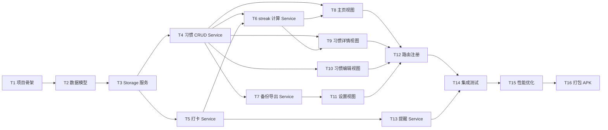

# 任务清单 · habit_zh 0.1.0

> 移动App工厂 · 项目2 / 流程2.3 · 输出
> 拓扑排序：每个任务 <4h；前置完成后才能开始后续

## 任务依赖图

## 任务表

| ID | 任务 | 模块 | 预估 | 前置 | 验收 |
|---|---|---|---|---|---|
| T1 | 项目骨架生成 | scaffold | 0.5h | — | `apps/habit_zh/` 创建成功 + uv sync |
| T2 | 数据模型实现 | models | 2h | T1 | Habit/CheckIn/Streak 3 模型 + 单测 |
| T3 | Storage 服务 | services/storage | 1.5h | T2 | JSON 文件读写 + 单测覆盖 |
| T4 | 习惯 CRUD Service | services/habit_service | 2h | T3 | 增删改查归档 + 单测 |
| T5 | 打卡 Service | services/check_in_service | 2h | T3 | 打卡/补打/取消 + 单测 |
| T6 | streak 计算 | services/streak_service | 2h | T4, T5 | 跨日宽限逻辑 + 单测 |
| T7 | 备份导出 Service | services/backup_service | 1.5h | T4 | JSON/CSV 导出 + 单测 |
| T8 | 主页视图 | views/home_view | 3h | T4, T6 | 列表+打卡+streak 显示 |
| T9 | 习惯详情视图 | views/habit_detail_view | 2.5h | T4, T6 | 热图+统计 |
| T10 | 习惯编辑视图 | views/habit_edit_view | 2.5h | T4 | 表单+频率选择 |
| T11 | 设置视图 | views/settings_view | 2h | T7 | 备份/导出/导入按钮 |
| T12 | 路由注册 | routes.py | 1h | T8-T11 | 4 路由生效 |
| T13 | 提醒 Service | services/reminder_service | 2h | T5 | 按 weekday+time 调度 |
| T14 | 集成测试 | tests/integration | 2h | T12, T13 | E2E 主流程 |
| T15 | 性能优化 | 全栈 | 1.5h | T14 | 启动<3s、内存<150MB |
| T16 | 打包 APK | flet build | 1h | T15 | `releases/habit_zh_0.1.0.apk` |

## 工时汇总

- 模型+服务层：T2-T7 = 11h
- UI 层：T8-T12 = 11h
- 通知+测试+优化+打包：T13-T16 = 6.5h
- **合计：28.5h**（约 7 个工作日）

## 阶段性里程碑

| 里程碑 | 任务集 | 验证方式 |
|---|---|---|
| M1 数据层完成 | T2-T7 | 全部 service 单测通过 |
| M2 UI 层完成 | T8-T12 | 浏览器预览主流程跑通 |
| M3 集成完成 | T13-T14 | E2E 测试通过 |
| M4 发布就绪 | T15-T16 | APK 构建成功 + 启动<3s |

## 关键风险与对策

| 风险 | 影响 | 对策 |
|---|---|---|
| Flet notification API 在 Android 真机表现不一致 | T13 卡 | 先做 web 预览版无通知；T13 推到 v0.2 |
| JSON 存储数据增长后 IO 变慢 | 后期性能 | MVP <1000 条无忧；v0.2 切 SQLite |
| Flet 0.86 的 ft.app() 已废弃 | 启动报错 | T1 改用 ft.app.run() |
| 跨日宽限逻辑复杂 | T6 bug | T6 单测必须覆盖 04:00 边界 |
